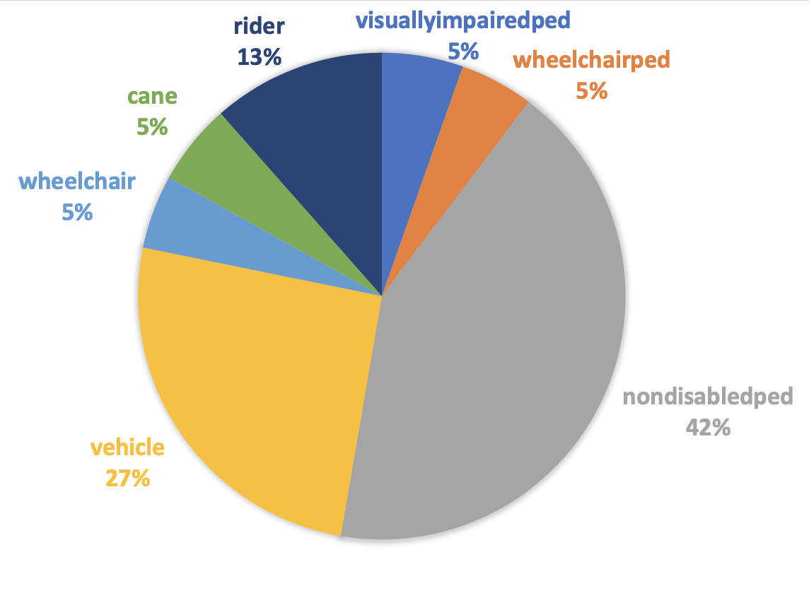
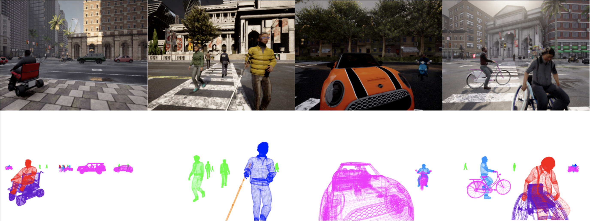

# 3D Mesh Reconstruction Dataset

We collect data across four towns, 14 settings with various weather conditions and times of day in a recent proposed Xworld environment (Zhang et al., [2021](https://openaccess.thecvf.com/content/ICCV2021/papers/Zhang_X-World_Accessibility_Vision_and_Autonomy_Meet_ICCV_2021_paper.pdf)). In each town, we spawn 150 vehicles and 300 pedestrians 20% of which are disabled pedetrians. The dataset consists of 3752 training images and 3790 testing images containing 4186 visually impaired pedestrians and canes, 3788 wheelchaired pedestrians and wheelchairs, 32746 nondisabled pedestrians, 19697 vehicles, and 8848 riders. The class statistics are shown in below


## Examples



## Access the data

### Dataset link
* [MeshData](https://drive.google.com/drive/folders/1c1tMHgXwNEEuJR-YwapavObSoCQAQUM6?usp=sharing) - Link to the data repository.


### Dataset format

The dataset includes ground-truth of rgb images, instance segmentation, mesh, voxel and all annotations. The dataset structure is as shown below. You can use the example json file to convert the data into coco format further usage.
```
Root Dir/
  -Town01/
    -000/
      -annotation 
      -depth
      -instance
      -mesh
      -mesh_anno
      -mesh_cam_frame
      -rgb
      -rgb_w_mesh 
      -segmentation
      -voxel
    -001/
    -...
  -Town02/
    -000/
    -001/
    -...
  -Town03/
    -000/
    -001/
    -...
  -Town05/
    -000/
    -001/
    -...
  -Town10HD/
    -000/
    -001/
    -...
  -mesh.json

```

## Contact us

* **email us** - mobility@bu.edu

## License

This project is licensed under the MIT License - see the [LICENSE.md](LICENSE.md) file for details

## Acknowledgments

* Hat tip to anyone whose code was used
* Inspiration
* etc
