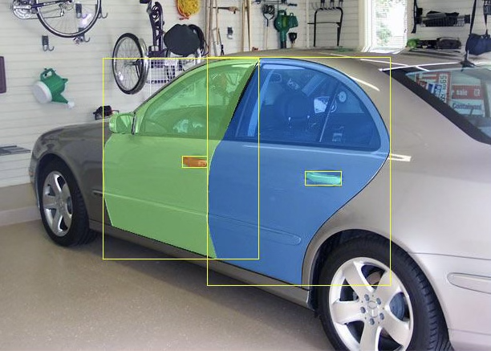

# Car Parts Detection and Segmentation


## Examples



## Access the data

### Dataset link
* [Car Parts Data]() - Link to the data repository.


### Dataset format

The dataset includes ground-truth of rgb images, instance segmentation, mesh, voxel and all annotations. The dataset structure is as shown below. You can use the example json file to convert the data into coco format further usage.
```
Root Dir/
  -Town01/
    -000/
      -annotation 
      -instance
      -rgb
      -rgb_w_mesh 
      -segmentation
      -voxel
    -001/
    -...
  -Town02/
    -000/
    -001/
    -...
  -Town03/
    -000/
    -001/
    -...
  -Town05/
    -000/
    -001/
    -...
  -Town10HD/
    -000/
    -001/
    -...
  -instance.json

```

## Contact us

* **email us** - mobility@bu.edu

## License

This project is licensed under the MIT License - see the [LICENSE.md](LICENSE.md) file for details

## Acknowledgments


